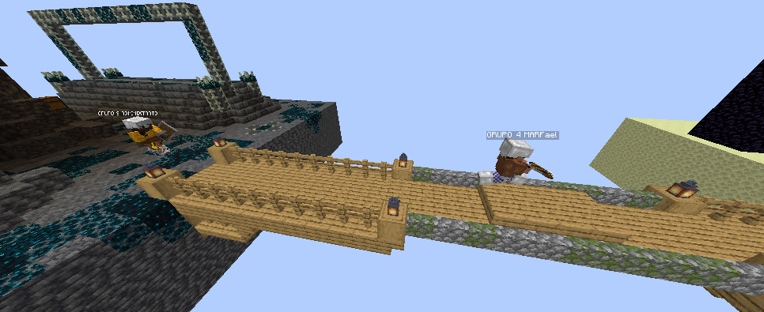

<h1 align="center">BattleSessions</h1>

<p align="center">
    
</p>

<p align="center">
    O plugin BattleSessions adiciona um novo minigame PvP onde os jogadores coletam recursos e lutam em ilhas conectadas por pontes geradas durante a partida.
</p>

## Funcionalidades

- Comandos /fight <Modo de jogo>, /ptop <Modo de jogo> <Quantidade de players listadps>
- Geração Randomizada de Baús, Itens e localização de spawn na partida


## Screenshots





## Rodando os testes


```bash
  
```


## Autores

- [@ivnls](https://www.github.com/ivnls)

