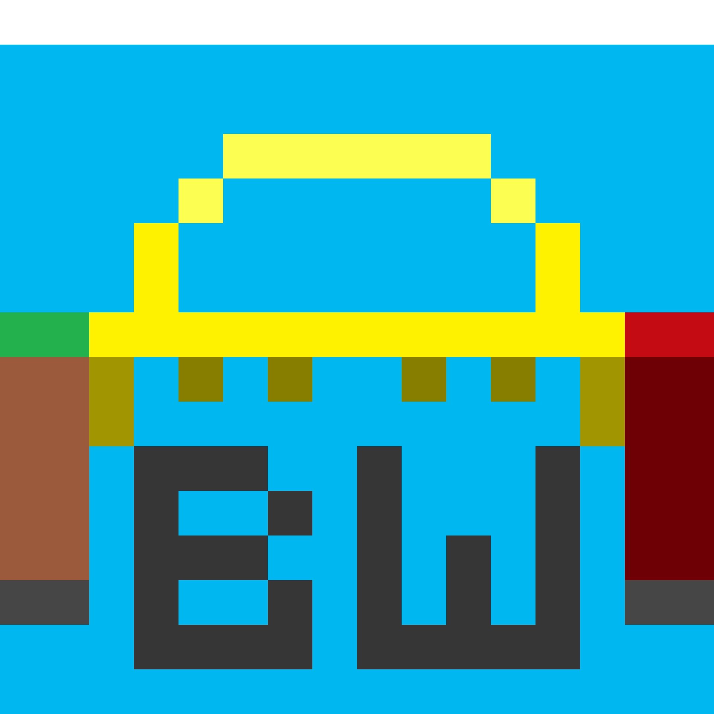
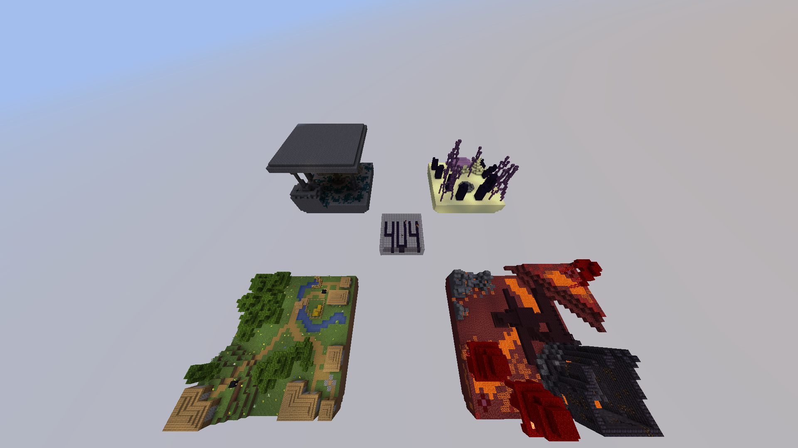
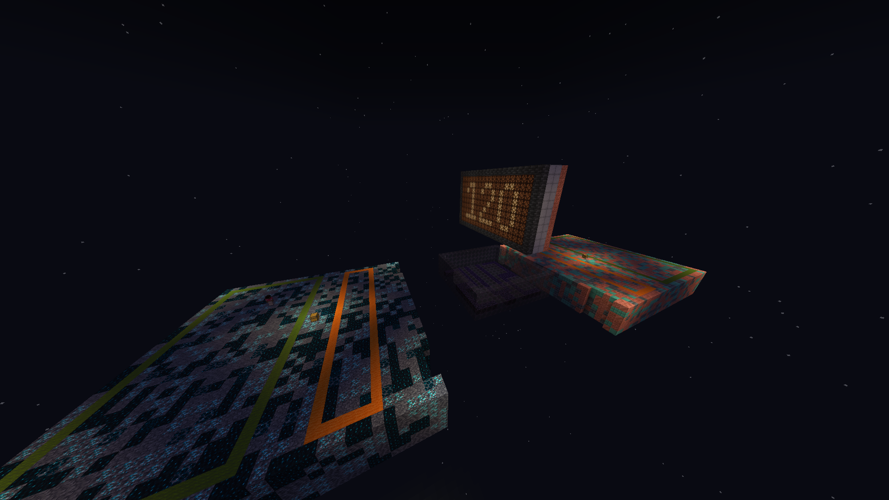
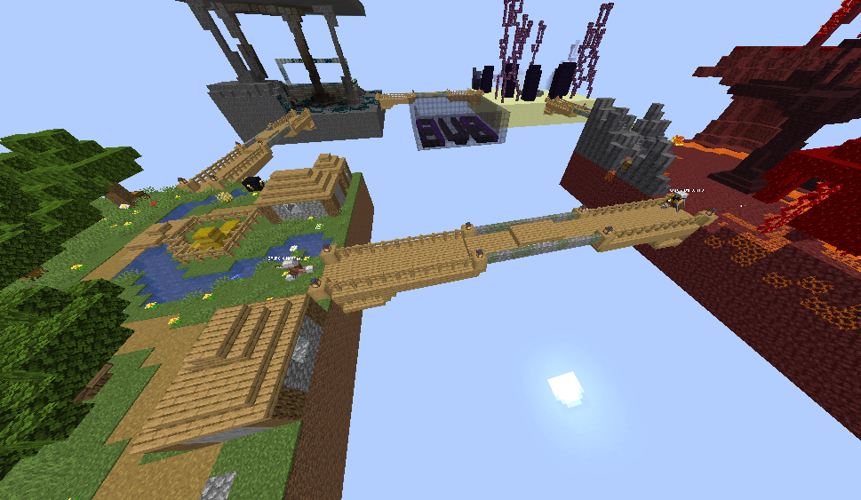
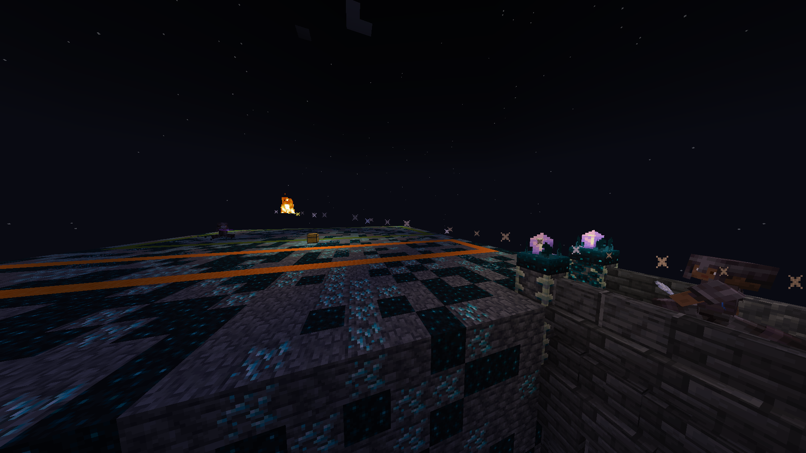
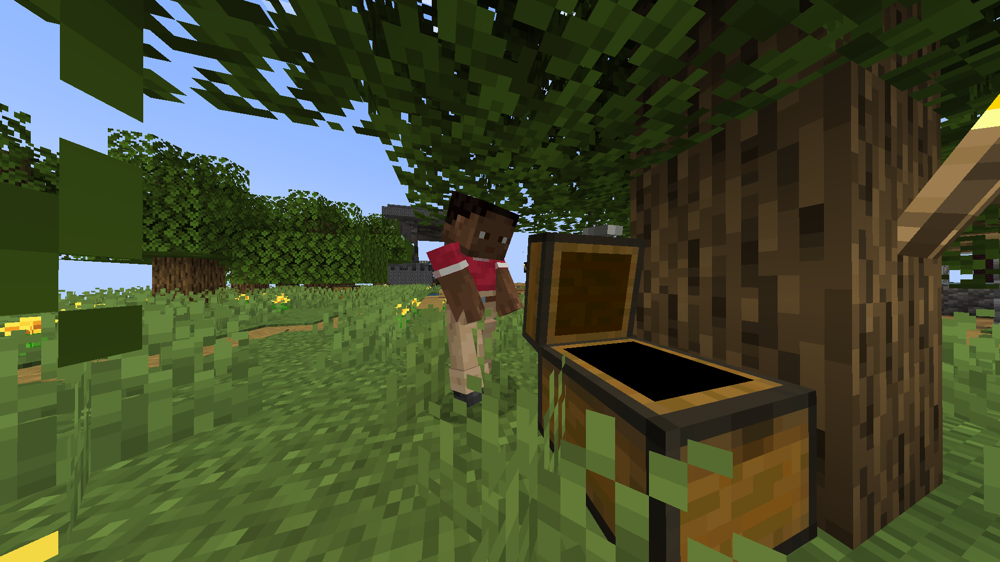
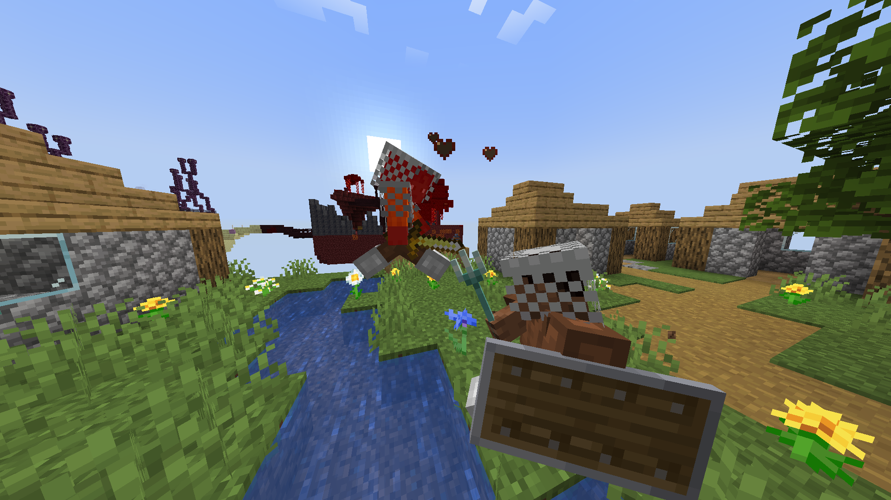

<h1 align="center">BridgeWars</h1>

    

    

    O projeto Bridge Wars visa criar um modo de jogo completo e otimizado, jogadores lutarão entre si em ilhas voadoras conectadas por pontes que serão geradas em um momento da partida.
    Por enquanto o sistema de ranks é bem simples, são 7 ranks com a pontuação definida com o número de vitórias em ambos os modos de jogo.

## Funcionalidades

- Comandos /fight <Modo de jogo>, /ptop <Modo de jogo> <Quantidade de players listadps>
- Geração Randomizada de Baús, Itens e localização de spawn na partida

## Screenshots

## SERVER OFICIAL (BEDROCK E JAVA EDITION):

- bw.ivanhauu.tech

## Autores do Plugin e Servidor:

